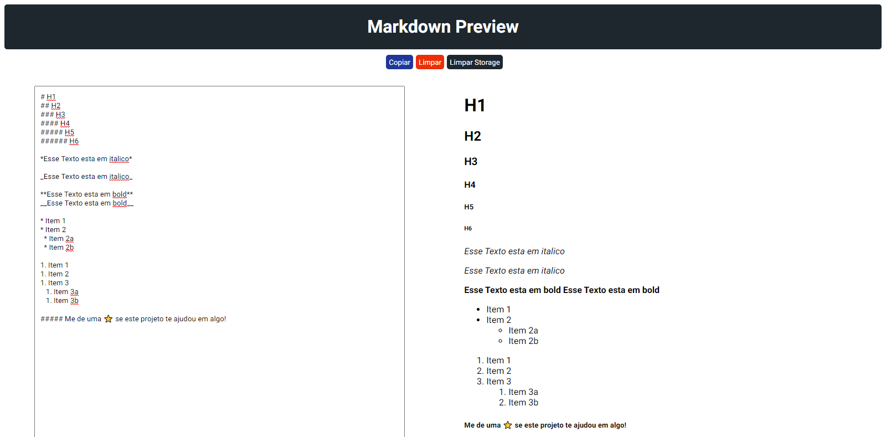
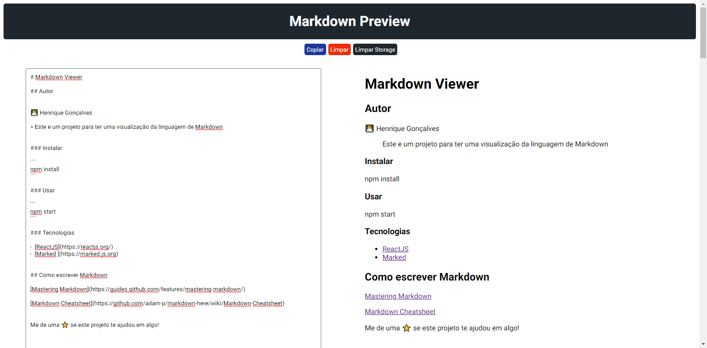

<h1 align="center">Markdown Viewer</h1>

## Autor

👨‍💻 Henrique Gonçalves

> Este e um projeto para ter uma visualização da linguagem de Markdown

## Instalar

```sh
npm install
```

## Usar

```sh
npm start
```

## Tecnologias

- [ReactJS](https://reactjs.org/)
- [Marked ](https://marked.js.org)

## Como escrever Markdown

[Mastering Markdown](https://guides.github.com/features/mastering-markdown/)

[Markdown Cheatsheet](https://github.com/adam-p/markdown-here/wiki/Markdown-Cheatsheet)

</br>



</br>



</br>

Me de uma ⭐️ se este projeto te ajudou em algo!
